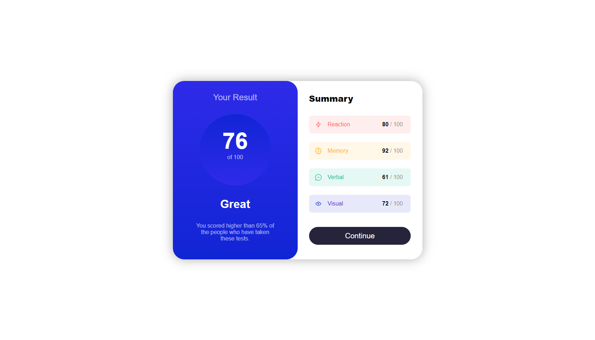

# Frontend Mentor - Results summary component

---

## Welcome! 👋

Thanks for checking out this front-end coding challenge.

[Frontend Mentor](https://www.frontendmentor.io) challenges help you improve your coding skills by building realistic projects.

## [m07mmmad-nasr's solution](https://github.com/m07mmad-nasr/results-summary-challenge-09)

## Overview

### Screenshot

#### Desktop

#### Mobile

.png>)

### Links

- Solution URL: [Solution](https://github.com/m07mmad-nasr/results-summary-challenge-09)
- Live Site URL: [Live Site](https://results-summary-challenge-09.vercel.app/)

## My process

### Built with

- Semantic HTML5 markup
- CSS custom properties
- SASS
- Flexbox
- Mobile-first workflow

**Have fun building!** 🚀
